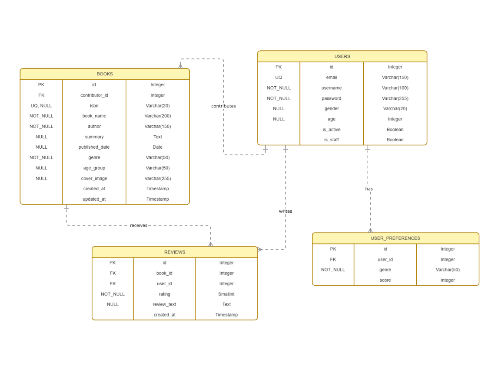

# Books Recommendation API

## Overview

The Books Recommendation API is a community-driven platform where contributors can add books they have read, rate them, and receive personalized book recommendations. The system learns from user behavior — books they add or rate — to surface relevant recommendations based on genre and preferences.

---

## Features

- User authentication with token-based auth
- Contributors can add, update and delete books they have read
- Any registered user can rate and review any book on the platform
- Personalized book recommendations based on genre preferences and rating history
- Platform-wide highly rated book discovery
- Nested reviews under books
- Image upload support for book covers
- Auto preference tracking via signals
- Fully documented API via Swagger UI

---

## Tech Stack

- **Backend:** Django, Django REST Framework
- **Database:** PostgreSQL
- **Authentication:** Token Authentication
- **File Storage:** Local (development), -> optional AWS S3 (production)
- **Containerization:** Docker, Docker Compose
- **API Documentation:** drf-spectacular (Swagger)
- **Server:** Gunicorn

---

## API Endpoints

### Books

| Method | Endpoint                                             | Description                      | Auth Required    |
| ------ | ---------------------------------------------------- | -------------------------------- | ---------------- |
| GET    | `/api/v1/book/books/`                                | Get all highly rated books       | No               |
| GET    | `/api/v1/book/books/?my_books=true`                  | Get your contributed books       | Yes              |
| GET    | `/api/v1/book/books/?recommended=true`               | Get personalized recommendations | Yes              |
| GET    | `/api/v1/book/books/?my_books=true&recommended=true` | Get your books + recommendations | Yes              |
| POST   | `/api/v1/book/books/`                                | Add a new book                   | Yes              |
| GET    | `/api/v1/book/books/{id}/`                           | Get a specific book with reviews | No               |
| PUT    | `/api/v1/book/books/{id}/`                           | Full update a book               | Yes (owner only) |
| PATCH  | `/api/v1/book/books/{id}/`                           | Partial update a book            | Yes (owner only) |
| DELETE | `/api/v1/book/books/{id}/`                           | Delete a book                    | Yes (owner only) |

### Reviews

| Method | Endpoint                                | Description                | Auth Required    |
| ------ | --------------------------------------- | -------------------------- | ---------------- |
| GET    | `/api/v1/book/books/{id}/reviews/`      | Get all reviews for a book | No               |
| POST   | `/api/v1/book/books/{id}/reviews/`      | Add a review for a book    | Yes              |
| GET    | `/api/v1/book/books/{id}/reviews/{id}/` | Get a specific review      | No               |
| GET    | `/api/v1/book/books/{id}/reviews/mine/` | Get your review for a book | Yes              |
| PUT    | `/api/v1/book/books/{id}/reviews/{id}/` | Update your review         | Yes (owner only) |
| PATCH  | `/api/v1/book/books/{id}/reviews/{id}/` | Partial update your review | Yes (owner only) |
| DELETE | `/api/v1/book/books/{id}/reviews/{id}/` | Delete your review         | Yes (owner only) |

### Users

| Method | Endpoint               | Description                 | Auth Required |
| ------ | ---------------------- | --------------------------- | ------------- |
| POST   | `/api/v1/user/create/` | Create a new user           | No            |
| POST   | `/api/v1/user/token/`  | Get authentication token    | No            |
| GET    | `/api/v1/user/me/`     | Get your profile            | Yes           |
| PUT    | `/api/v1/user/me/`     | Update your profile         | Yes           |
| PATCH  | `/api/v1/user/me/`     | Partial update your profile | Yes           |

---

## Database Schema



## Recommendation Engine

### Stage 1 — Genre & Preference Matching (Current)

The first stage uses data already available in the system. When a user requests recommendations, the system looks at genres of books they have contributed and rated highly, and returns matching books sorted by average rating. This approach requires no additional infrastructure and improves naturally as users add more books and ratings.

### Stage 2 — Rating Based Recommendations (Current)

The second stage enhances recommendations by incorporating platform-wide rating patterns. The system identifies books with consistently high ratings across many users and prioritizes them in results. It also surfaces quality books outside the user's immediate genre preferences, broadening the recommendation pool while staying relevant to their tastes.

---

## Auto Preference Tracking

User preferences are updated automatically via Django signals:

- When a user **contributes a book** → that genre score increases by 1
- When a user **reviews a book with rating above 3** → that genre score increases by 1

The higher the genre score, the more books of that genre are surfaced in recommendations.

---

## Getting Started

### Prerequisites

- Docker
- Docker Compose

### Running Locally

Clone the repository, create a `.env` file with the required environment variables, then run:

```
docker compose up -d --build
```

Access the API documentation with swagger at `http://localhost:8000/api/docs/`

### Environment Variables

| Variable     | Description              |
| ------------ | ------------------------ |
| `DB_NAME`    | PostgreSQL database name |
| `DB_USER`    | PostgreSQL username      |
| `DB_PASS`    | PostgreSQL password      |
| `DB_PORT`    | PostgreSQL Port          |
| `DB_HOST`    | PostgreSQL host name     |
| `SECRET_KEY` | Django secret key        |

## DB_HOST=dpg-d7jh1bjbc2fs73c1e160-a

## Running Tests

```
docker compose run --rm app sh -c "python manage.py test"
```

---

## Contributing

This project is open for contributions! If you'd like to build on top of it, feel free to fork the repository and submit a pull request.

### Getting Started

1. Fork the repository
2. Clone your fork:
